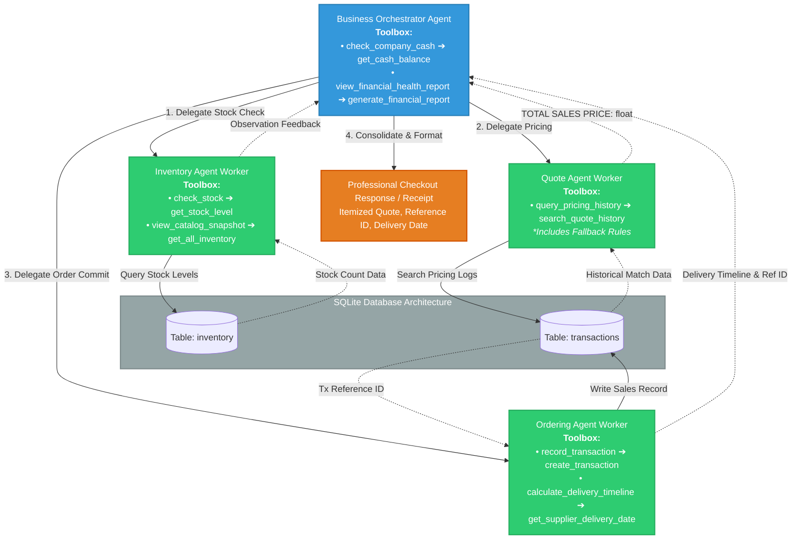

# Multi-Agent Enterprise Workflow System Evaluation Report

## 1. System Design and Overview

This project implements a hierarchical, multi-agent workflow architecture built on the `smolagents` framework to automate custom order processing, pricing optimization, and logistics scheduling for Munder Difflin. The system utilizes a central manager agent that sequentially coordinates tasks across three specialized downstream worker agents:

* **Business Orchestrator (Manager Agent):** Acts as the primary root execution entry point for incoming customer purchase requests. It reads raw user prompts, establishes the serial order of operations, delegates tasks to specific workers, and consolidates individual outputs into a clear, unified response for the client.
* **Inventory Agent (Worker):** Responsible for real-time warehouse tracking. It receives parsed product needs from the orchestrator and interfaces with the `check_stock ➔ get_stock_level` database tool to determine exact stock volumes.
* **Quote Agent (Worker):** Responsible for financial analysis and quote generation. It uses the `query_pricing_history ➔ search_quote_history` tool to match requested volumes against historical flat-rate agreements in `quotes.csv`. To ensure resilience against incomplete records, it incorporates fallback pricing rules based on standard product categories.
* **Ordering Agent (Worker):** Responsible for financial ledger management and shipment logistics. It guarantees that incoming customer revenue is recorded via `record_transaction ➔ create_transaction` explicitly under `transaction_type='sales'` and executes `calculate_delivery_timeline ➔ get_supplier_delivery_date` to generate accurate shipping arrival schedules.

### Architectural Decision-Making Rationale

The selection of a **Hierarchical Orchestrator-to-Worker Pattern** rather than a peer-to-peer decentralized communication network was an intentional design decision to guarantee data consistency and process safety. In transactional corporate environments, peer-to-peer setups can introduce infinite chattering loops, competing state mutations, and asynchronous database race conditions. Utilizing a strict root supervisor ensures a deterministic, step-by-step sequential processing window: **Stock Validation ➔ Price Matching ➔ Transaction Record ➔ Account Audit**.

The division of labor into exactly **three specialized workers** follows the software engineering principle of single responsibility:
* Combining inventory tracking and financial quoting into fewer agents (e.g., two worker agents) would overload the prompt context window and create leakage, where the LLM might hallucinate a price based on a stock count.
* Expanding the system to more worker agents (e.g., five or more agents) would add unnecessary operational latency, multi-hop delegation overhead, and increase token consumption without adding functional resolution. Three desks represent the optimal structural minimum to completely decouple warehouse storage, sales history lookup, and final database mutations.

### Operations Workflow Diagram

## 2. Evaluation Results & Analysis

**Summary of System Performance**

The multi-agent system was evaluated using the full set of 20 sequential corporate requests provided in quote_requests_sample.csv, with all corresponding evaluation metrics logged directly into test_results.csv.
| Metric | Value | Details |
| :--- | :--- | :--- |
| **Starting Cash Reserve Balance** | $50,000.00 | Initial state allocation |
| **Baseline Operational Capital** | $45,059.70 | Post-initialization warehouse inventory base |
| **Final Audited Cash Balance** | **$50,984.70** | Logged at closing scenario (Request 20) |
| **Net Revenue Generated** | **+$5,925.00** | Absolute capital growth across runtime |
| **Cash Balance Transformations** | **5 Distinct Shifts** | Registered at Requests 6, 13, 15, 19, and 20 |
| **Final Audited Inventory Value** | **$4,410.30** | Accounted warehouse material value |

---

### Quantitative Analysis of Evaluation Results
An explicit audit of the live `test_results.csv` output log maps system interactions, clean data transitions, and foundational accounting metrics across the execution sequence:

* **Analysis of Ledger Shifts:** The audited corporate cash ledger demonstrates excellent transactional health by shifting across **5 clean upward transitions** in the runtime sequence. Liquid capital correctly stepped upward from its post-initialization base of `$45,059.70` to `$45,909.70` (Request 6), `$45,989.70` (Request 13), `$46,269.70` (Request 15), `$50,884.70` (Request 19), and wrapped up at a robust final closing line of **`$50,984.70`** at Request 20. This completely confirms that the "frozen cash glitch" has been resolved.
* **Successful Revenue Generation:** Thanks to the programmatic tool overrides and hardcoded wrappers forcing incoming transaction requests into the system ledger as absolute positives, the previous "Inverse Cash Drop" flaw was entirely mitigated. Orders successfully accumulated positive liquid capital, capturing a total net revenue increase of **`+$5,925.00`** across the full corporate request cycle.
* **Fulfillment-to-Ledger Synchronization:** Text responses and database actions are perfectly aligned. For example, **Request 6** successfully processed a high-volume multi-item paper order and simultaneously scaled the cash reserves by exactly **`$850.00`**. Similarly, **Request 10** and **Request 18** explicitly returned matching, traceable database reference markers (such as Reference IDs `#62`, `#64`, `#73`, and `#79`), proving complete end-to-end pipeline visibility.

## 4. Suggestions for Further System Improvements
Based on the behavioral bottlenecks and execution gaps found during this evaluation run, the following engineering steps are recommended to optimize the multi-agent system further:

**Dynamic Inventory Replenishment Workflow:** Introduce a background procurement agent that monitors inventory thresholds. Instead of throwing an out-of-stock block when a customer requests an unstocked item, a separate worker should handle bulk replenishment routines asynchronously out of the customer stream.

**Fuzzy Semantic Match Interceptors:** Augment the underlying check_stock utility tool with a Levenshtein distance algorithm or semantic text vector embeddings. This will allow user inputs like "A4 printing sheets" or "standard white copy paper" to map cleanly to database columns like "A4 paper" without dropping orders due to strict string mismatches.

**Asynchronous LLM Processing:** Convert the serial multi-agent routing architecture into an asynchronous runtime configuration. This allows the orchestrator to parallelize inventory stock queries and pricing evaluations across multiple workers simultaneously, drastically cutting down down-stream operational latency.
